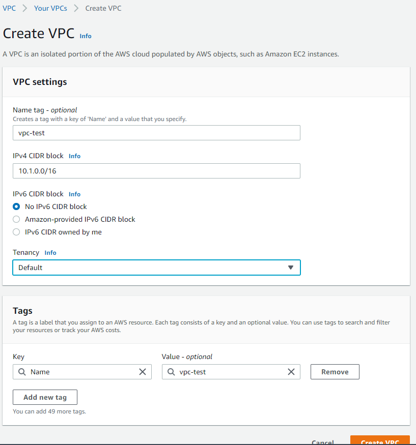
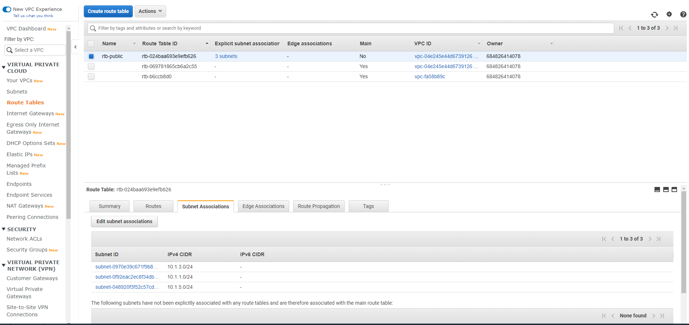
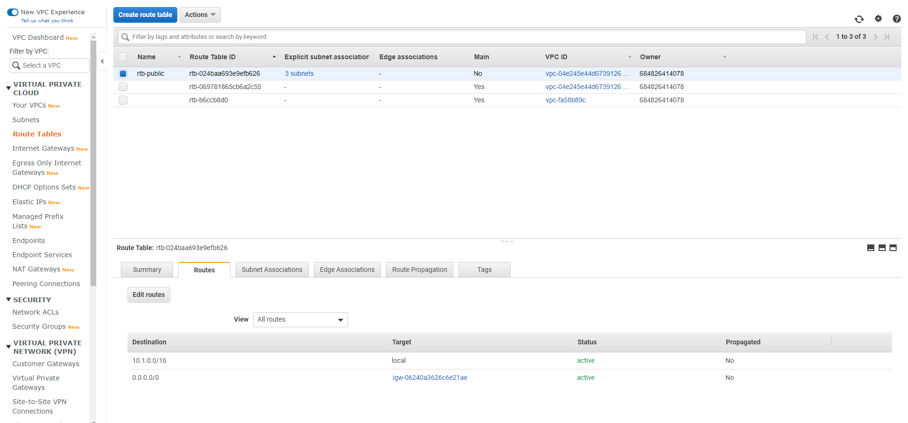
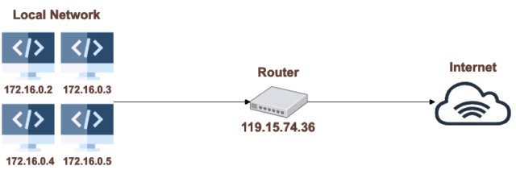
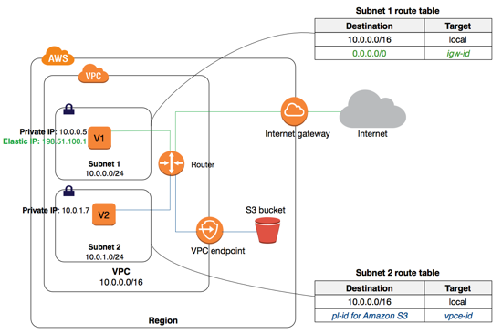
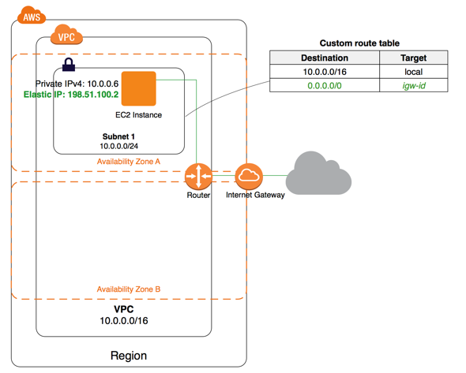
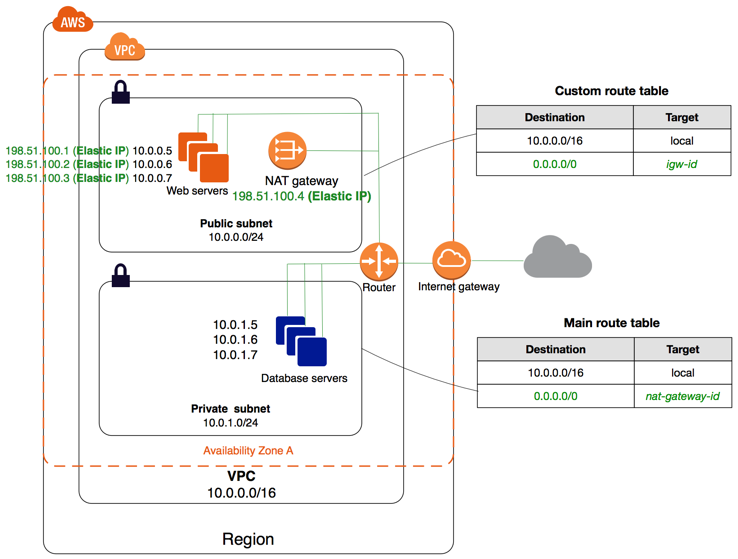

NAT_VPC_routetable.md

## Nguon tham khao
- https://blog.tda.company/tim-hieu-ve-vpc-virtual-private-cloud/
- https://dev.classmethod.jp/articles/nat-instance-trong-vpc/

- https://cloudcraft.info/mot-lan-di-len-may-dao-mot-vong-aws-networking/

# VPC (Virtual private cloud) là gì?
 giúp bạn **tạo ra môi trường tách biệt** giữa nhiều hệ thống khác nhau, giữa nhiều môi trường cùng hệ thống AWS. 
 Bạn có thể **toàn quyền quyết định môi trường ảo của bạn** từ việc lựa chọn dải `IP của riêng bạn`, tạo các `mạng con (Subnet)`,`bảng định tuyến (route table)` hay khả năng kết nối internet `(Internet gateway, NAT)`… 
 
 Bạn cũng có thể dễ dàng thay đổi cấu hình VPC, tạo các mạng con có khả năng public ra môi trường internet cho web application, tạo các mạng riêng tư không có kết nối internet để đặt máy chủ database. 
 Ngoài ra, bạn có thể cài đặt các lớp bảo vệ hạn chế truy cập, từ chối truy cập từ địa chỉ IP nào đó, hoặc chỉ địa chỉ IP nào đó được phép truy cập vào hệ thống của bạn. `Security groups` và `Network access control lists (NACL, Network ACL)` sẽ giúp bạn làm những việc này. 

# VPC gồm những gì?
Bản thân VPC chỉ có 1 thông tin quan trọng nhất là thông tin thiết lập dải mạng IP mà bạn chọn. Dải mạng này quyết định các IP của các dải mạng con sau này bạn sử dụng.  

Như bạn thấy, khi tạo mới 1 VPC thì thông tin quan trọng bạn cần chú ý là **IPv4 CIDR block**.

### EIP (Elastic IP) là gì? 

Elastic IP là dịch vụ cung cấp IP tĩnh cho resource AWS. 
Tại sao lại cần Elastic IP nhỉ ? 
Ví dụ khi bạn sử dụng dịch vụ EC2, bạn cấp cho EC2 1 IPv4 cho instance, nhưng thật buồn thay, nếu bạn stop instance và start lại, aws sẽ cấp cho bạn 1 IPv4 mới. Nếu bạn hosting web lên đây thì thật là 1 rủi ro phải không.

Elastic IP giải quyết cho bạn vấn đề này. Ngoài ra, khi bạn có thay đổi resource gắn Elastic IP một cách vô cùng linh hoạt(chuyển instance). **Mặc định Elastic IP là miễn phí, bạn chỉ phải trả tiền trên resource bạn sử dụng với Elastic IP**. *Nhưng nếu bạn không gắn Elastic IP cho 1 resource nào, thì AWS sẽ charge tiền của bạn* kha khá đó. AWS muốn tránh việc lãng phí IP đó. 

### Tips chia IP và cách chia IP

Về cách chia subnet các bạn tự tìm hiểu thêm trên google có khá đầy đủ. (tham khảo khoá free của Candrill: link)

Với những bạn muốn làm nhanh, thì mình chỉ cách chia dễ hiểu nhất. Như mình:
- dùng VPC thì sẽ để là `10.1.0.0/16` (chú ý là `/16` nhé). Các IP của mình sẽ được bắt đầu từ với *10.1.xxx.xxx*. 
- Khi chia Subnet, mình sẽ để `/24`. Mình chia Các subnet thành `10.1.1.0/24`, tức là mình được sử dụng ~250 IP trong subnet này bằng cách fix cố định *10.1.1.xxx*. 
Các subnet sau tương tự sẽ là 10.1.2.0/24, 10.1.3.0/24. Bằng cách này khi bạn chia subnet sẽ **không bị trùng dải subnet**. Và nó cũng khá dễ nhớ. Còn về bản chất bạn tìm hiểu cách chia là sẽ hiểu tại sao mình chia như thế nhé.

## Subnet, IG, NAT Gateway và Route table

### Subnet

Subnet **chia VPC thành những mạng con khác nhau**. Trong cùng 1 vpc, bạn không được phép chia các Subnet có IP chồng chéo lên nhau đâu nhé. Việc chia để trị này giúp bạn quản lý dễ dàng hơn so với việc phải quản lý một mạng VPC lớn to đùng đùng. 

Các subnet thường chia thành 2 loại: 
- public subnet: có quyền truy cập internet từ cả 2 chiều.
- private subnet: chỉ được phép truy cập internet từ 1 chiều từ subnet ra ngoài internet và không hỗ trợ chiều ngược lại. 

Vậy điều gì quyết định private subnet và và public subnet ? Đó chính là do thông tin **route table** và **internet gateway**.

### IG (Internet gateway)

Internet gateway là một service của VPC, free, **được gắn vào cùng VPC cho phép VPC được truy cập internet**. 

Việc *gắn IG* là tiền điều kiện: để 1 subnet có thể truy cập internet, bạn còn cần *thiết lập thêm route table*. `Một Subnet là **Public subnet** khi được gắn **route table có IG**`.

### NAT Gateways

Một **Private subnet** là **subnet không được phép truy cập từ ngoài internet (chỉ được phép truy cập internet từ 1 chiều từ subnet ra ngoài internet và không hỗ trợ chiều ngược lại)**. 
Vậy ta chỉ cần không gắn IG là được rồi?! Thực ra là đúng, nhưng chưa đủ, vì nếu máy chủ của bạn *call API từ 1 service bên ngoài* hoặc cần *update bản vá lỗi* nào đó, hoặc *cập nhật phần mềm* thì phải làm như nào?

Có khá nhiều giải pháp như việc bạn dùng thêm 1 máy chủ trong public subnet, và dùng máy chủ này làm máy chủ trung gian cho phép gọi thông tin từ bên ngoài internet. Còn AWS cung cấp một dịch vụ gọi là **NAT gateways**. 

NAT Gateways **cho phép subnet được quyền truy cập ra ngoài internet nhưng các yêu cầu từ bên ngoài internet trục tiếp vào subnet thì không thể**. 
NAT Gateways là truy cập 1 chiều, không giống với IG là truy cập được từ cả 2 chiều ra và vào. 

**NAT là dịch vụ mất phí nên các bạn cân nhắc khi sử dụng NAT.**

### Route table
Route table giúp chúng ta định nghĩa được subnet được truy cập IG hay NAT hay không. 

Route table giống như 1 bảng chỉ đường, **chỉ cho những kết nối tới vị trí cần thiết thì cần phải đi đường nào**. Trong hệ thống ứng dụng lớn, Route table có tác dụng rất lớn trong việc chỉ các kết nối tới đúng vị trí résource cần thiết trong hệ thống mạng. Route table được gắn vào subnet 

Như bạn thấy bản chỉ đường của route table khá dễ hiểu phải không ? Đầu tiên là gọi các IP 10.1.xxx.xxx thì sẽ gọi theo local (cùng VPC) Các trường hợp còn lại (0.0.0.0/0) thì sẽ gọi tới internet gateway (call internet).
## NACL và SG

### NACL (Network Access Control Lists)

NACL là một `lớp bảo mật cho VPC`, thực hiện như một firewall điều khiển lưu lượng vào và ra của một hay nhiều subnet.

### SG (Security Group)
Security Group là service bảo mật của AWS. Nó `cho phép resource được phép truy cập từ IP nào, tới port nào`. 

Security Group có 2 bảng cấu hình là inbound và outbound. 
Mặc định, outbound được mở tất cả. 

# NAT Instance trong VPC

Trong mạng riêng VPC (virtual private cloud) trên AWS cloud, **có 2 hình thức giúp Instance của chúng ta kết nối tới Internet, đó là `NAT Gateway` và `NAT Instance`**.  
chúng ta sẽ cùng tìm hiểu về `NAT Instance` và thử thiết lập một NAT Instance đơn giản.

## NAT là gì?
NAT (Network Address Translation, "Dịch địa chỉ mạng") là **một quá trình `thiết bị mạng` cung cấp `một địa chỉ cho thiết bị trong mạng local` để nó thiết bị đó có thể kết nối với internet**.

Chúng ta đều biết, để kết nối với internet, thiết bị cần có một Public IP, nhưng các thiết bị trong mạng Local thì không. Vì vậy **NAT giúp chúng ta giải quyết vấn đề này bằng cách dịch địa chỉ mạng Private IP sang Public IP và vẫn `đảm bảo tính bảo mật cho thiết bị mạng local`**. NAT thường được tiến hành bởi `routers` hoặc `firewall`.

**NAT *cung cấp 1 địa chỉ public IP duy nhất* cho tất cả các thiết bị trong mạng local**. Điều này vừa giúp dễ dàng quản lý vừa giúp tiết kiệm chi phí.

Bạn có thể hiểu rõ hơn qua hình dưới đây:

Các máy tính trong cùng mạng Local có các địa chỉ Private IP là 172,16.0.2, 172,16.0.3, 172,16.0.4, 172,16.0.5. Nhưng chúng đều kết nối tới Internet thông qua một địa chỉ Public IP duy nhất đó là 119.15.74.36.

## NAT Instance là gì?
Đến đây, ta có thể hiểu đơn giản như sau:

Instance là một máy tính ảo được cung cấp bởi Amazon Web Services. Do vậy **NAT Instance là những máy tính ảo *đóng vai trò dịch địa chỉ mạng từ private IP sang Public IP*, là trung gian giúp những máy tính ở mạng private kết nối được với internet**.

Bạn có thể hiểu hơn thông qua hình vẽ dưới đây:

Có thể thấy, EC2 Instance của chúng ta nằm ở một Private subnet, không hề có kết nối tới Internet. Nó kết được kết nối tới một `NAT Instance` nằm ở một Public Subnet. 
Thông qua NAT Instance này, EC2 Instance có thể kết nối tới Internet một cách an toàn.

## Lab thiết lập 1 NAT Instance
xem https://dev.classmethod.jp/articles/nat-instance-trong-vpc/

# Dạo một vòng AWS Networking

Chúng ta bắt đầu từ cánh cổng AWS Networking hay còn có cái tên mà chủ nhà AWS đặt cho nó là `VPC Networking`. Trên cánh cổng được khắc trổ đầy đủ các thành phần thật đẹp và chi tiết, như:
- Network Interface
- Route Tables
- Internet Gateways
- Egress-only Internet Gateway
- DHCP Option Sets
- DNS
- Elastic IP Address
- VPC Endpoints
- NAT
- VPC Peering
- ClassicLink

Trông tất cả mọi thứ như một bức tranh “Sơn Hà Xã Tắc”, Jeff đã mở cánh cổng, chậm rãi dắt tôi đi vào khuôn viên của AWS và bắt đầu giới thiệu một cách say sưa. Ngay tại tiền hoa viên của gian thứ nhất, tôi thấy một bàn cờ bằng ngọc, không sai đâu đó là bàn cờ mà ở đó VPC được khắc họa thật tinh sảo. Cùng tôi tìm lại trí nhớ về bàn cờ VPC đó nhé!

###  AWS Virtual Private Cloud – Bàn cờ “ngũ” căn
Ngay từ cái tên, tôi đã bắt gặp anh chàng “ấn tượng” thật điển trai. Đây có thể gọi là cloud ảo trên nền cloud AWS, thật thú vị là trong cloud lại có cloud. VPC thuộc về riêng một tài khoản AWS, và không lẫn lộn giữa các tài khoản. Còn private, Jeff đã cẩn thận để nói rằng, cloud luôn đề cao tính private cho người sử dụng. Chúng ta vừa được đặt để vào một môi trường vừa tách biệt, vừa riêng tư.

Ngũ “căn” trong bàn cờ AWS VPC được bày ra như sau:
- IP Address Range
- Subnets
- Route Tables
- Network Gateways
- Security Settings.

Sau khi hỏi tôi đã nhớ được các “căn” trên bàn cờ hay chưa, Jeff tiếp tục dẫn tôi đến ngự hoa viên, nơi mà Jeff có thể thoải mái mời tôi tách trà và dạy cho tôi cách thưởng “hoa”.

Vừa vào đến ngự hoa viên, quả là một khung cảnh kỳ vĩ, với nhiều hoa, nhiều chủng loại, với tách trà trên tay, tôi cũng chỉ “cưỡi ngựa xem hoa” vì cũng chẳng có nhiều thời gian cho giấc mơ.

### IP Address Range & Subnet – Mảnh đất hoa viên và chậu hoa
Trên mỗi VPC, sẽ có nhiều address range được định nghĩa, và sẽ tồn tại xuyên suốt hệ thống của chúng ta. Address range sẽ định nghĩa nên dãy IP rộng thường sẽ là /16 hoặc /8. Trên mỗi Address Range lại được chia ra thành các khu vực khác nhau, gọi là subnet, mỗi subnet được chia một khoảng không gian IP trong Address range. Cũng giống như mảnh đất hoa viên được chia ra thành các khu vực, mỗi khu vực là một loại cây, loại hoa khác nhau, cách bố trí chậu hoa cũng khác.

Có 2 loại subnet:
- Private subnet: dành cho các resource chỉ giao tiếp trong nội bộ VPC.
- Public subnet: dành cho các resource giao tiếp ra ngoài Internet.

### Route Table – Bảng chỉ dẫn trong hoa viên rộng lớn
Mỗi subnet sẽ có một bảng định tuyến riêng biệt, **tại một thời điểm subnet chỉ có 1 bảng định tuyến, nhưng ngược lại, bảng định tuyến có thể được áp dụng cho nhiều subnet**. Tôi đã bước vào hoa viên và tự tin rằng mình sẽ không bị lạc, nhưng tôi đã sai, với phong cảnh và độ rộng lớn của hoa viên AWS, tôi không thể không để ý đến bảng chỉ dẫn.

Cũng giống như vậy, các traffic trên AWS cần được định tuyến đúng, và thậm chí là có thể định tuyến theo ý của người dùng, để điều lượng traffic đi từ subnet đi đến nới mà chúng ta mong muốn như router, internet gateway, hoặc một virtual appliance định sẵn.

### Security settings – Những người bảo vệ trong hoa viên
Jeff thật giàu có, và cũng thật yêu cây cỏ. Ông đã thuê mướn hẳn một đội bảo vệ để canh giữ cho hoa viên của mình để không bị những tên hacker trộm lẻ hay những kẻ hái hoa bắt bướm có thể lọt vào nơi mà ông không mong muốn, hoặc quấy rầy những vị khách của ông mời đến giống như tôi.

Để bảo vệ các resources trong subnet:
- Sử dụng security groups.
- Sử dụng Network access control list (ACL).

Cả 2 cách này đều làm chung một nhiệm vụ đó chính là “chặn” và “cho phép” như bình thường chúng ta vẫn hay làm trên các hệ thống khác. **Việc chặn này áp dụng đến layer 4, có nghĩa rằng nó có thể chặn ở mức IP, Port, TCP/UDP**.

### VPC Endpoint – Cửa vào kho vật liệu trang trí hoa viên
VPC Endpoint đóng vai trò là cầu nối, và **là kết nối riêng biệt** để các instance trong VPC **có thể giao tiếp với các dịch vụ khác trên AWS** mà không cần đi qua Internet, NAT, VPN, hay AWS Direct Connect**.

VPC Endpoint sẽ có một ID định danh để có thể `điều hướng traffic` từ VPC đến service. Tất cả các traffic đi từ VPC đến AWS Service đều **không đi ra khỏi AWS network**.

### (Elastic) Network Interfaces
Elastic Network Interface –> interfaces ảo. Bao gồm các thành phần:
- Primary private IPv4
- 1 hoặc nhiều Secondary private IPv4
- 1 Elastic IP trên mỗi private IPv4 (cả primary & secondary)
- 1 Public IPv4
- 1 hoặc nhiều IPv6
- Được gán với 1 hoặc nhiều security groups khác nhau
- 1 MAC address
- 1 cờ đánh dấu là source hoặc destination.
- Phần mô tả mở rộng về interface.

### Internet Gateway – Cửa hàng bán hoa của Jeff
Thành phần ảo được AWS tạo ra để kiểm soát truy cập ra Internet

Bao gồm 2 chức năng chính:
- Gateway đi ra Internet được khai báo trong routing table của subnet.
- Đóng vai trò là NAT để mapping private IPv4 sang public IPv4.

### Egress-only Internet Gateways
Chỉ sử dụng với IPv6.

Egress-only có nghĩa rằng chỉ có instance bên trong VPC mới có thể khởi tạo kết nối ra bên ngoài Internet, và ngăn chặn bên ngoài Internet khởi tạo kết nối vào bên trong.

Traffic đi từ instance bên trong VPC sẽ được route table forward đến Egress-only Internet GW, và response ngược trở lại instances. Có nghĩa rằng, phiên giao tiếp giữa trong và ngoài chỉ được tạo ra khi và chỉ khi instance bên trong khởi tạo.

Lưu ý:
- Egress-only Internet GW không được gắn với bất kì resource group nào.
- Có thể gắn resource group cho instance trong private subnet để kiểm soát traffic ra vào.
- Có thể sử dụng ACL để kiểm soát traffic toàn subnet.

### Network Address Translation (NAT)
Chỉ sử dụng với IPv4. Với IPv6 sẽ sử dụng egress-only Internet Gateway.

Có 2 loại NAT devices là NAT gateway và NAT Instance.

#### NAT gateway
- Hỗ trợ lên đến 10Gbps. Nếu có nhu cầu sử dụng nhiều hơn 10Gbps thì phân tải ra nhiều subnet, mỗi subnet tạo 1 NAT gateway.
- Chỉ có đúng 1 Elastic IP được gán với NAT gateway. Và không thể tháo EIP đó ra khỏi NAT sau khi NAT gateway được tạo. muốn sử dụng EIP khác thì phải tạo NAT gateway mới, chỉnh lại routing table và delete NAT gateway cũ.
- Các protocol hỗ trợ: TCP, UDP, ICMP
- Không thể gán security group cho NAT gateway. Thay vào đó sử dụng security group & ACL để control traffic.
- Khi NAT gateway được tạo ra thì mặc định NAT gateway được gán 1 private IP.

Tham khảo:

Theo như trên hình, các servers ở private subnet chuyển traffic đi ra internet đi qua NAT gateway.
NAT gateway forward traffic từ private ra internet thông qua Elastic IP. thay thế source IP của packet bằng Elastic IP.

#### NAT instance
Tương tự NAT Gateway
AWS recommend sử dụng gateway vì bandwidth và độ sẵn sàng cao hơn. 
Nhưng NAT instance thì có thể sử dụng trong một số trường hợp đặc biệt (vd ???).

Bảng so sánh NAT gateway & NAT instance:

| **Attribute**        | **NAT gateway**                                                                                                                                                                           | **NAT instance**                                                                                                                                                                  |
|----------------------|-------------------------------------------------------------------------------------------------------------------------------------------------------------------------------------------|-----------------------------------------------------------------------------------------------------------------------------------------------------------------------------------|
| Availability         | Highly available.  NAT gateways in each Availability Zone are implemented with redundancy.  Create a NAT gateway in each Availability Zone to ensure zone-independent architecture.       | Use a script to manage failover between instances.                                                                                                                                |
| Bandwidth            | Supports bursts of up to 10Gbps.                                                                                                                                                          | Depends on the bandwidth of the instance type.                                                                                                                                    |
| Maintenance          | **Managed by AWS.You do not need to perform any maintenance.**                                                                                                                            | Managed by you, for example, by installing software updates or operating system patches on the instance.                                                                          |
| Performance          | Software is optimized for handling NAT traffic.                                                                                                                                           | A generic Amazon Linux AMI that’s configured to perform NAT.                                                                                                                      |
| Cost                 | Charged depending on the number of NAT gateways you use, duration of usage, and amount of data that you send through the NAT gateways.                                                    | Charged depending on the number of NAT instances that you use, duration of usage, and instance type and size.                                                                     |
| Type and size        | Uniform offering; you don’t need to decide on the type or size.                                                                                                                           | Choose a suitable instance type and size, according to your predicted workload.                                                                                                   |
| Public IP addresses  | Choose the Elastic IP address to associate with a NAT gateway at creation.                                                                                                                | Use an Elastic IP address or a public IP address with a NAT instance. You can change the public IP address at any time by associating a new Elastic IP address with the instance. |
| Private IP addresses | Automatically selected from the subnet’s IP address range when you create the gateway.                                                                                                    | Assign a specific private IP address from the subnet’s IP address range when you launch the instance.                                                                             |
| Security Groups      | Cannot be associated with a NAT gateway. You can associate security groups with your resources behind the NAT gateway to control inbound and outbound traffic.                            | Associate with your NAT instance and the resources behind your NAT instance to control inbound and outbound traffic.                                                              |
| NACLs                | Use a network ACL to control the traffic to and from the subnet in which your NAT gateway resides.                                                                                        | Use a network ACL to control the traffic to and from the subnet in which your NAT instance resides.                                                                               |
| Flow Logs            | Use flow logs to capture the traffic.                                                                                                                                                     | Use flow logs to capture the traffic.                                                                                                                                             |
| Port forwarding      | Not supported.                                                                                                                                                                            | Manually customize the configuration to support port forwarding.                                                                                                                  |
| Bastion servers      | Not supported.                                                                                                                                                                            | Use as a bastion server.                                                                                                                                                          |
| Traffic metrics      | Not supported.                                                                                                                                                                            | View CloudWatch metrics.                                                                                                                                                          |
| Timeout behavior     | When a connection times out, a NAT gateway returns an RST packet to any resources behind the NAT gateway that attempt to continue the connection (it does not send a FIN packet).         | When a connection times out, a NAT instance sends a FIN packet to resources behind the NAT instance to close the connection.                                                      |
| IP fragmentation     | Supports forwarding of IP fragmented packets for the UDP protocol.Does not support fragmentation for the TCP and ICMP protocols. Fragmented packets for these protocols will get dropped. | Supports reassembly of IP fragmented packets for the UDP, TCP, and ICMP protocols.                                                                                                |
